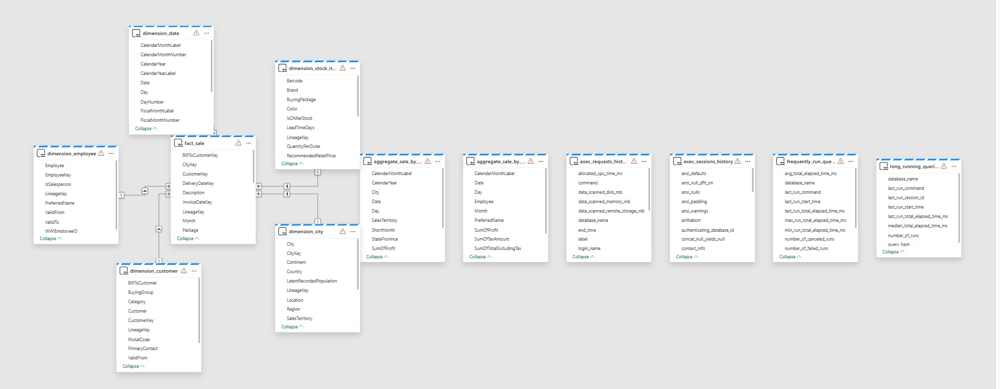

# Wide World Importers (WWI) – Microsoft Fabric Data WareHouse E2E Scenario

## 🎯 Objective
Build an end-to-end data engineering solution using Microsoft Fabric to ingest, transform, and analyze data from the Wide World Importers (WWI) dataset, and visualize KPIs .

## 🛠️ Stack & Tools
- **Microsoft Fabric** (T-SQL, Stored procedure, Datawarehouse, LakeHouse, note book, Power BI)
- **OneLake** (Delta Lake format)
- **Pipeline ** (for optional ingestion)
- **PowerBI** (for Reporting)

## 🔄 Solution Architecture
1. Ingest Parquet files from WWI dataset in Azure Storage  into Datawarehouse using Fabric pipeline, Copy activity
2. Load Dimension tables  and fact table from Files in data warehouse using T-SQL
4. Perform transformations (e.g., joins, aggregations), Time traveling using  Views, ISQL, Stored proecdures.
5. Uae Shortcuts in warehhpuse to avoid duplication of data in Lakehosuse
6. Visualize KPIs in Power BI connected to the Dataware house.

## 📈 Example KPIs
- Top 10 Products by Sales

## 🧱 Dataset
Based on Microsoft's [Wide World Importers sample]
SQLs: ./DbScripts

## 🖼️ Visuals
  

## 🚀 Setup
1. Clone this repo
2. Set Up Workspace
3. Set up  Datawarehouse .
4. set up piple line and ingest sample data
5. Set up short cut to Lakehouse
4. Run T-SQLs and procedures
5. Prepare reports

## 📊 What I Learned
- DatawareHouse, Ingestion from Azure storage
- set up Star Schema ( Facts and Dimensions)
- T-SQL, Stored proecdures, short cuts
- Clones and time travelling
- Reporting 
- Query optimization:
    - Indexing, Partitioning, B-trees, reduce table scan

## 👩‍💻 Author
Roshny George 
